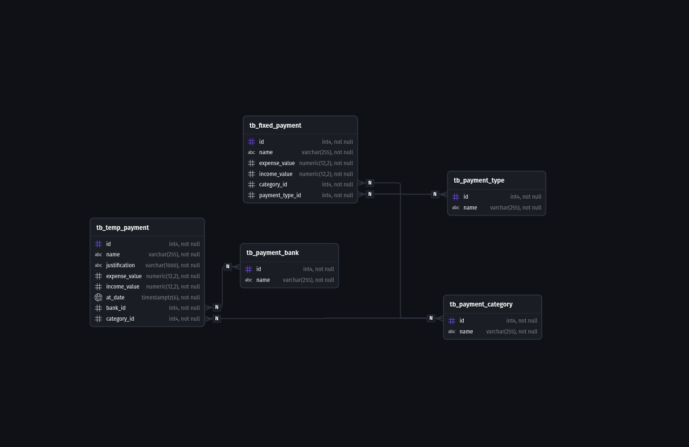

# 💰 Personal Finance DB

Um banco de dados relacional em PostgreSQL otimizado para gestão financeira pessoal. 

Este projeto foi desenhado com foco em **performance**, **integridade matemática** e **arquitetura modular**. Ele separa os compromissos fixos dos lançamentos pontuais e utiliza agregações prévias (Derived Tables) para evitar duplicidade de dados em relatórios cruzados.

---

## 🏗️ Arquitetura das Tabelas

O banco de dados está dividido em duas categorias principais de tabelas: Tabelas de Domínio (Cadastros) e Tabelas Transacionais.

### 📌 Tabelas de Domínio (Dicionários)
Armazenam as categorias e classificações que alimentam as transações.
* `tb_payment_category`: Categorias de gastos/ganhos (ex: Moradia, Alimentação, Lazer).
* `tb_payment_type`: Formas de pagamento (ex: Pix, Cartão de Crédito, Dinheiro).
* `tb_payment_bank`: Instituições financeiras e bancos (ex: Nubank, Itaú, Inter).

### 💸 Tabelas Transacionais
Armazenam o fluxo de caixa, separando o que é estático do que depende de tempo.
* `tb_fixed_payment`: Contas recorrentes e salários fixos. Não possuem data específica atrelada, pois representam um valor base mensal constante.
* `tb_temp_payment`: Lançamentos pontuais (despesas ou dívidas que não são fixas). Esta tabela é o motor de buscas temporais do sistema: ela possui um campo `at_date` (`TIMESTAMPTZ`) projetado especificamente para permitir a filtragem e a contabilização exata de gastos em qualquer período de tempo solicitado (dias, meses, anos).

---

## 📊 Funcionalidades e Views (Relatórios)

A lógica de negócios e extração de relatórios foi encapsulada em **Views** modulares, facilitando o consumo dos dados por qualquer API ou Backend.

### 1. Extratos Detalhados (Listagens)
* `vw_detailed_fixed_payments`: Lista detalhada de todos os compromissos fixos.
* `vw_detailed_temp_payments`: Lista detalhada de todos os lançamentos pontuais.

### 2. Análise por Categoria (Agregações)
* `vw_total_fixed_expenses_by_category`: Soma de todos os gastos fixos por categoria.
* `vw_total_temp_expenses_by_category_current_month`: Soma os lançamentos pontuais do **mês atual**, filtrados por categoria.
* `vw_total_expenses_by_category`: Cruza as categorias com os totais fixos e pontuais.

### 3. Balancetes e Resumos Financeiros
* `vw_fixed_balance`: Saldo apenas das contas fixas.
* `vw_current_month_balance`: Saldo dos lançamentos pontuais filtrados pelo mês vigente.
* `vw_total_current_month_balance`: O balanço final unificado (Fixos + Pontuais do mês).

---

## 🐳 Como Executar com Docker

A infraestrutura foi desenhada para rodar em containers, garantindo isolamento e facilidade de deploy.

**1. Crie o volume para persistência dos dados:**
```bash
docker volume create personal-postgresql-volume
```

**2. Suba o container usando a imagem customizada:**
```bash
docker run --name personal-postgre --rm -d -p 5432:5432 --mount type=volume,source=personal-postgresql-volume,target=/var/lib/postgresql/data nauakavlis/my-personal-postgre-config
```

**3. Injete as estruturas e dados iniciais:**
> Obs: A utilização do docker exec -i é necessária para injetar e executar os arquivos .sql locais diretamente no banco, evitando a necessidade de criar binds/mapeamentos de arquivos com o container.
>
```bash
docker exec -i personal-postgre createdb -U postgres personal_finance # criation of a specif database
docker exec -i personal-postgre psql -U postgres -d personal_finance < personal_finance_structure.sql
docker exec -i personal-postgre psql -U postgres -d personal_finance < personal_finance_views.sql
docker exec -i personal-postgre psql -U postgres -d personal_finance < personal_finance_essential_data.sql
```

## 📝 Exemplo de Inserção de Transação (Lançamento Pontual)

Para registrar um novo gasto ou entrada variável no sistema, insira na tabela `tb_temp_payment`. O banco cuidará de buscar os IDs corretos nas tabelas de domínio.

```sql
INSERT INTO tb_temp_payment (name, justification, expense_value, income_value, at_date, bank_id, category_id, payment_type_id) VALUES
(
  'Compra de Notebook', 'Compra de um notebook para uso pessoal e profissional.', 3500.00, 0.00,
  '2024-06-15T10:30:00Z',
  (SELECT id FROM tb_payment_bank WHERE name = 'Nubank'),
  (SELECT id FROM tb_payment_category WHERE name = 'Tecnologia'),
  (SELECT id FROM tb_payment_type WHERE name = 'Cartão de Crédito')
),
(
  'Venda de Celular', 'Venda de um celular usado para um amigo.', 0.00, 1200.00,
  '2024-06-20T14:45:00Z',
  (SELECT id FROM tb_payment_bank WHERE name = 'Nubank'),
  (SELECT id FROM tb_payment_category WHERE name = 'Tecnologia'),
  (SELECT id FROM tb_payment_type WHERE name = 'Pix')
);
```

## 💾 Backup e Restauração

Manter os dados financeiros seguros é crucial. Utilize os comandos abaixo no seu terminal para extrair ou restaurar backups do volume Docker.

**Para realizar o Backup:**
```bash
docker exec -t personal-postgre pg_dump -U postgres personal_finance > backup_financeiro_$(date +%Y%m%d).sql
```

## 💾 Backup e Restauração

Manter os dados financeiros seguros é crucial. Utilize os comandos abaixo no seu terminal para extrair ou restaurar backups do volume Docker.

**Para realizar o Backup:**
```bash
docker exec -t personal-postgre pg_dump -U postgres personal_finance > backup_financeiro_$(date +%Y%m%d).sql

```

*(O arquivo será gerado na raiz de onde o terminal estiver aberto, com a data atual no nome).*

**Para realizar o Restore:**

```bash
cat backup_financeiro_20260310.sql | docker exec -i personal-postgre psql -U postgres -d personal_finance
```

*(Altere a data do arquivo `.sql` conforme o backup que deseja restaurar).*


# DER


